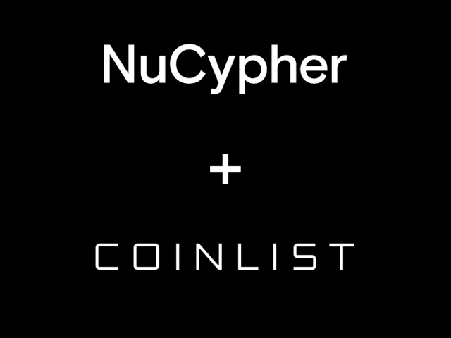
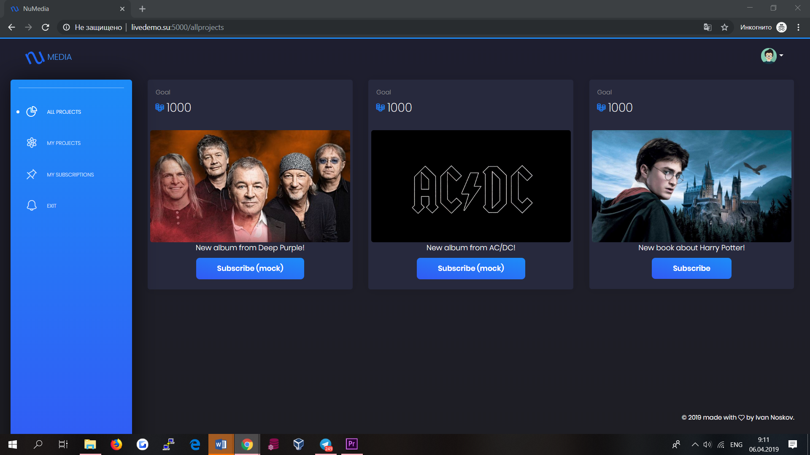
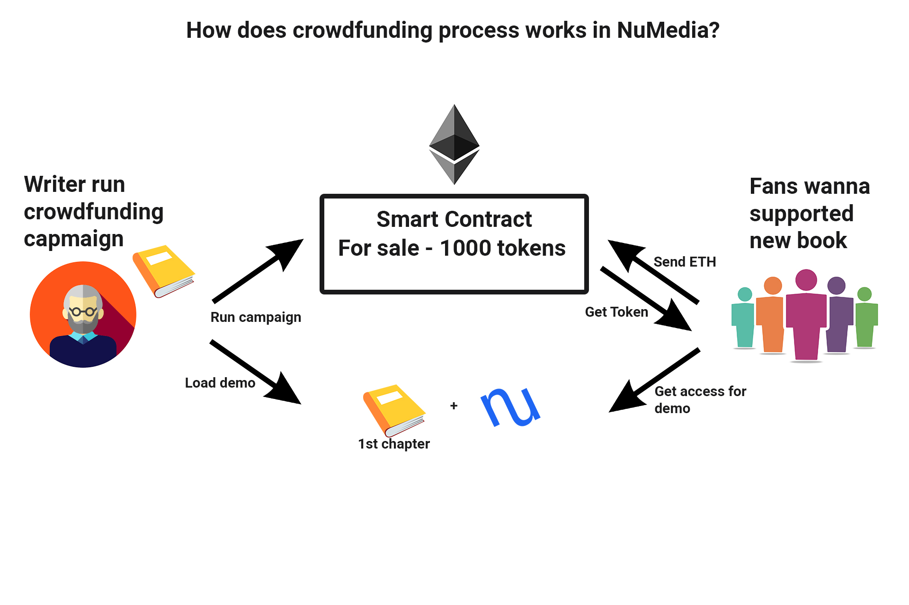

# NuMedia

# Structure

<ol type="1" style="font-size: x-large;">
<li> About
<li> Solution
<li> How does it work?
<li> Finally
<li> Contacts
</ol>

# About
Nowadays crowdfunding is one of the main way to realise your product. A lot of famous people included artists, 
writers and musicians use crowdfunding. But using current media crowdfunding platforms have a number of drawbacks. 
For example, it is difficult for a crowdfunding member to track the seller’s progress in the development of a product (a book, 
a music album, etc.). Also when product was finished but not released, the participant would like to be sure of what he is paying for.
But when displaying a product (or part thereof), the seller cannot be sure that the buyers will not transfer it to other persons. 
My project "NuMedia" easy solves all these problems thanks to blockchain and NuCypher technologies.

<a href="https://youtu.be/4TScwfwWAeM" target="_blank">Video-presentation of the NuMedia</a>

# Solution

NuMedia is implemented as a web application, so that it can be used at any convenient time.  
***To create campaigns and support projects you need Metamask browser extension***.

The livedemo of application you can try in action right now at the link: 

<a href="http://livedemo.su:5000">LiveDemo</a>

Application exists two parts:
1. Public ethereum blockchain for creating and supproting crowdfunding campaigns
2. NuCupher technology for encrypt and share date of campaigns

# How does it work? 

Every crowdfunding company is a smart contract in a public blockchain Ethereum, which sale exclusive tokens. Everyone can support project and buy this tokens for ethereum coins. After that they can see seller's demo data, which he encrypt with NuCypher and shared for them. 
Smart contract exists all information about project (author, title of project, amount of tokens for sale, how many tokens you can buy for 1 ETH etc). 
s case all reward transfer to my account from smartcontract. In another case, all balance of smartcontract returns to owners of exclusive tokens. 
It means, that everyone, who supported project can delegate their ownership to another person and in this case blockchain with NuCypher technology give us a guarantee that they will not have access to release product. 

Advantages of NuMedia:

- This is a safe method of interaction between the organizers and participants of the crowdfunding platform.
- Сrowdfunding member can track the seller’s progress in the development of a product and delegate his ownership to another person
- SmartContract gives money back guarantee to participants in case of company failure.

You can watch a video demonstration of the product: 

https://youtu.be/4TScwfwWAeM

# Finally

During this hackathon I've considered the project logic, implemented a first version of smart contract, integrated it with NuCypher technology and designed interface. For run this project in production I also need upgrade smartcontract functions, upgrade interface and test this system. It requires approximately 2 or 3 months.
- I've considered the project logic.
- I've implemented a first version of smart contract and deployed it into Ethereum testnet Rinkeby.
- I've implemented NuCypher encryption and sharing data between users of system.

To run this project in production I need ~2-3 months to refactoring my source code and fix bugs.

# Contacts

Ivan Noskov - vanya170595@gmail.com
